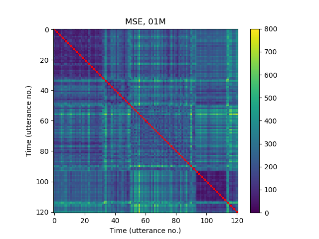
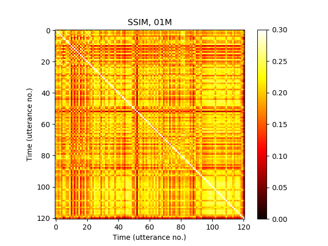
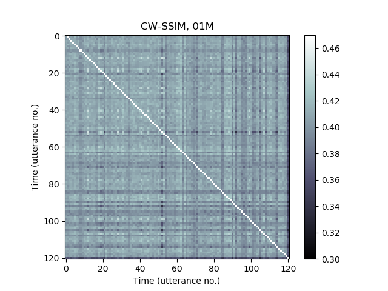

# All figuges for ,,Quantification of Transducer Misalignment in Ultrasound Tongue Imaging'' Interspeech 2020 paper

<table>
	<th>
		<td>MSE</td>
		<td>SSIM</td>
		<td>CW-SSIM</td>
	</th>
	<tr>
		<td>
			
		</td>
		<td>
			
		</td>
		<td>
			
		</td>
	</tr> 
</table>