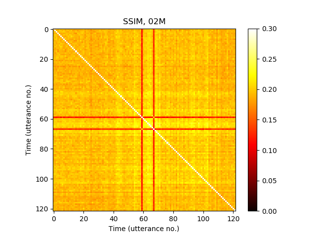

# All figures for ,,Quantification of Transducer Misalignment in Ultrasound Tongue Imaging'' Interspeech 2020 paper

<table>
	<tr>
		<th>MSE</th>
		<th>SSIM</th>
		<th>CW-SSIM</th>
	</tr>
	<tr>
		<td>
			
		</td>
		<td>
			
		</td>
		<td>
			
		</td>
	</tr> 
	<tr>
		<td>
			
		</td>
		<td>
			
		</td>
		<td>
			
		</td>
	</tr> 
</table>